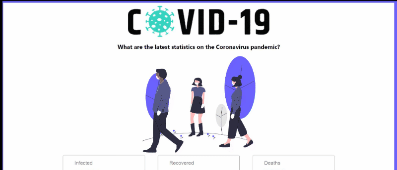

# covid-19 Tracker

  Covid-19 Tracker will help you track the latest data related to the noval corona virus across the globe. User can also see the the data based on country.

## Tech Stack Used: 
<code></code>
<code></code>
<code></code>
<code></code>

## <code>Sneak Peak</code>

### Installation and Setup Instructions

Clone this repository. 
You will need node and npm installed globally on your machine.  
Installation: npm install To install dependencies  
Run: npm run start

## Tech Library used:
<ul>
  <li>axios</li>
  <li>material-ui</li>
  <li>chart.js</li>
  <li>react-countup</li>
</ul>

### Happy Hacking
